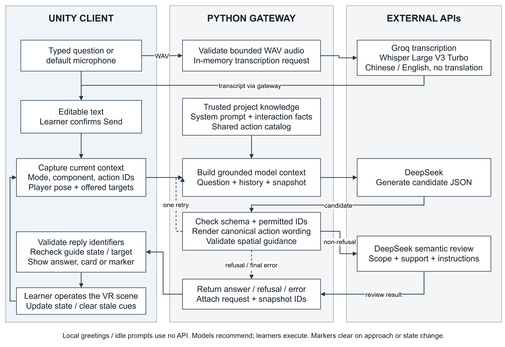

# VRMicroscope: Integrating Interactive Microscopy Simulation with Task-State-Aware AI Guidance in Virtual Reality

**Authors:** Tang Shaoyan$^{1,*}$, Pu Yunpin$^2$, Sui Si‘ao$^2$, Qammer Abbasi$^3$, Sajjad Hussain$^3$, Hu Min$^2$, Hasan Abbas$^{3,*}$  
**Affiliations:** $^1$National University of Singapore, Singapore; $^2$University of Electronic Science and Technology of China, China; $^3$University of Glasgow, United Kingdom  
**Corresponding Authors:** Tang Shaoyan (tangshaoyan@u.nus.edu), Hasan Abbas (Hasan.abbas@glasgow.ac.uk)

> **[EDITORIAL NOTE — REMOVE BEFORE SUBMISSION]** Figures 1, 2, and 4 below use runtime captures supplied in `Pic/`. Figure 3 now includes the original draw.io vector architecture diagram, and the optional evaluation figure remains conditional on real model-test data. The [figure plan](AIxVR2027_Figure_Plan.md) records the selection and remaining editorial checks.

## Abstract

VRMicroscope integrates interactive microscopy simulation with task-state-aware AI guidance for operational and conceptual learning. Its VR laboratory supports specimen handling, observation, coarse/fine focus, illumination and objective adjustment, exploded component inspection, and modules for numerical aperture (NA), spatial frequency, structured illumination, and THz s-SNOM. Authored visual mappings and simplified numerical models are explicitly distinguished from calibrated measurement. The assistant grounds responses in project knowledge, interface state, and available actions; application code validates identifiers, rejects stale guidance, creates spatial markers from scene geometry, and accepts user-confirmed Chinese/English speech transcripts. In an exploratory study, 18 of 19 participants completed the core workflow (94.7%); mean SUS was 82.4/100 and unweighted NASA-TLX was 32.4/100. Effort (44.7) and Mental Demand (42.9) were the largest workload dimensions. These single-group results support workflow feasibility and perceived usability, not causal learning gains from AI. The contribution is a shared state representation connecting physical interaction, bounded instructional simulation, and conversational guidance.

**Keywords:** virtual reality; microscopy education; interactive simulation; task-state awareness; large language models; speech input.

## 1. Introduction

Microscopy training requires learners not only to identify three-dimensional instrument components, but also to place specimens, adjust focus and illumination, switch objectives, and explain why the observed field changes. A virtual laboratory can provide a repeatable environment for exploring these operations, but it must make clear which feedback corresponds to real principles and which feedback is designed primarily for instructional purposes.

VRMicroscope combines an experimental layer of objects, controls, feedback, and experiment interfaces with an assistant that maps questions to project knowledge and currently accessible activities. The central challenge is consistency among interface state, simulation boundaries, and recommendations: real confocal operations such as pinhole adjustment or Z-stack acquisition must not be offered when absent, while an experiment entry already visible in a component panel should be used directly.

The main contributions of this work are:

1. We build a microscopy experimental environment that connects specimen manipulation, focus and illumination feedback, structural understanding, and three advanced instructional modules, while explicitly stating the inputs, outputs, and modeling boundaries of each activity.
2. We design an AI guidance architecture that combines project knowledge, current component descriptions, an available-action catalog, response validation, spatial markers, and confirmation-based speech input.
3. We evaluate the system through implementation-level conformance checks and an exploratory study with 19 participants, reporting task completion, perceived usability, and subjective workload without interpreting these measures as untested causal learning gains.

The system supports familiarization and conceptual exploration; real-instrument transfer, quantitative imaging, and incremental learning benefits from AI remain outside the present evidence.

## 2. Related Work and Research Positioning

Recent immersive-learning assistants connect generative AI to concrete activities. Chheang et al. separately reported task performance, SUS, NASA-TLX, presence, and interviews for VR anatomy assistants [1]. Geris and Alce logged latency, response duration, and cost for voice-based XR tutoring [2], while SpatialTutor combined object awareness, spatial guidance, and LLM support for procedural training [3]. These studies motivate separating interaction performance, task outcomes, subjective experience, and learning effects.

The present work focuses on the correspondence between microscopy learning activities and guidance. An operation must be genuinely available in the current interface, and its resulting feedback must be explained within an explicit scientific boundary of the simulation. We therefore treat the AI as a constrained tutoring layer embedded in the experimental environment rather than as an autonomous instrument-controlling agent, and we report implementation-level constraint behavior separately from user-level usability outcomes.

Quantitative confocal microscopy provides a scientific reference [4], and educational resources inform the NA and spatial-frequency modules [5], [6]. The project nevertheless lacks a calibrated acquisition pipeline, so its graphical mappings are not treated as physical measurements.

## 3. VR Experimental Environment and Simulation Boundaries

### 3.1 Laboratory Organization and Interaction States

The Unity laboratory supports desktop and XR interaction. `Roaming`, `Observing`, and `Tutorial` states coexist with local component and experiment states; viewpoint, object activation, permissions, and interface visibility determine available activities. Deferred state transitions and separate tutorial checks reduce conflicting input responses. The AI dialog blocks experimental input, so learners close it before acting. Figure 1 connects specimen handling, observation, adjustment, component inspection, and linked experiments in their shared laboratory.

<figure id="fig:environment">
<table>
<tr><td colspan="2"> <b>(a)</b> Laboratory overview with microscope, specimen and assistant entry point.</td></tr>
<tr><td> <b>(b)</b> Microscope observation station.</td><td> <b>(c)</b> Specimen handling area.</td></tr>
<tr><td> <b>(d)</b> Exploded component inspection.</td><td> <b>(e)</b> SNOM probe-selection station.</td></tr>
</table>
<figcaption><b>Fig. 1.</b> VRMicroscope learning environment and core activities. Learners handle specimens, observe microscope feedback, inspect components, and explore the SNOM workflow within one laboratory, with access to contextual assistant guidance. The panels are runtime captures from the project and are shown as representative views.</figcaption>
</figure>

**Table 1. Inputs, outputs, and instructional boundaries of the activities currently implemented in the project.**

| Activity and player input | Actual output | Intended instructional connection | Modeling boundary |
|---|---|---|---|
| Pick up, place, observe, and remove a specimen | Changes to the runtime specimen's parent object, pose, visibility, and observation environment | Connect specimen placement with instrument observation | Scripted object manipulation; contact mechanics have not been validated |
| Coarse/fine focusing and objective switching | Visibility, transparency, rendering feedback, and field-of-view size vary with the focus parameter | Search for an observable range first, then refine the adjustment | Manually defined focus ranges; no confocal point-spread-function calculation |
| Adjust illumination | Changes to light-cone line width and the brightness input to the specimen shader | Compare illumination settings with observation results | Dimensionless display gain, not calibrated illuminance |
| SuperAssembly and component selection | Exploded layout, component descriptions, and associated experiment buttons | Connect structure, function, and learning activities | Illustrative separation; does not evaluate real mechanical assembly |
| Adjust numerical aperture | Illustrative changes in light-cone geometry and specimen appearance | Explore collection angle and NA | Fixed-medium instructional model; NA does not uniquely determine magnification |
| Select spatial frequency and illumination | Grating/diffraction illustration and a Fourier display derived from the specimen texture | Connect periodic structure, diffraction, and spectral support | Simplified structured-illumination explanation |
| Select an SNOM probe and control the demonstration | Installation, tapping, scanning animations, and illustrative images | Understand the workflow of near-field microscopy | Procedural demonstration using synthetic outputs |

### 3.2 Specimen Manipulation and Observation

Picking up a specimen creates a tagged runtime copy attached to the hand. Distance and held-object checks gate placement; the program then standardizes pose and scale in the observation environment. Ownership, focus-dependent visibility, and observation mode remain separate. A microscopic camera renders the instrument view to its screen, and objective switching changes that camera's orthographic size.

### 3.3 Focus, Objectives, and Illumination

The focusing activity uses coarse adjustment to find an observable specimen range and fine adjustment to refine the display. Let $v$ be the dimensionless slider value and $j$ the objective index. For each objective, $f_j$ is the focus center, $r_j$ the visibility half-width, and $c_j$ the full-opacity half-width. With $e_j=|v-f_j|$, the specimen is active within $e_j\leq r_j$, with opacity

$$
\alpha_j(v)=
\begin{cases}
1,&e_j<c_j,\\
1-\dfrac{e_j-c_j}{r_j-c_j},&c_j\leq e_j\leq r_j.
\end{cases}
$$

Outside this interval the specimen is hidden; within it, a rendering-focus parameter is $300e_j/r_j$. Objective labels 5, 10, 50, and 100 use half-widths 0.17, 0.13, 0.07, and 0.04, with a 25:1 coarse/fine increment ratio. These are visual-feedback parameters, not calibrated displacement or pinhole transmission.

Objective switching rotates the turret and changes viewing scale; illumination changes light-line width and a dimensionless shader input. Focus centers, display gain, and camera sizes are software parameters requiring separate physical calibration.

### 3.4 Structural Exploration and Tutorial Constraints

SuperAssembly separates parts from the model center; learners select expanded components to access names, functions, and linked experiments. The upper optical assembly links to NA and the objective to spatial frequency, with the selected description and usable entry exposed as AI context. Tutorial checks record required operations, not conceptual mastery.

### 3.5 Numerical-Aperture Experiment

The NA activity provides a slider range of 0.03–0.95 and uses a fixed refractive index $n=1$:

$$
\mathrm{NA}=n\sin\theta,\qquad \theta=\arcsin(\mathrm{NA}/n).
$$

Here $\theta$ is the collection-cone half-angle. The interface jointly updates angle and cone geometry, linking numerical input to visible change [5], [7]. Magnification anchors and appearance are illustrative: NA remains distinct from magnification, and changes are not quantitative brightness, depth-of-field, or resolution measurements.

### 3.6 Spatial Frequency and Structured-Illumination Displays

The spatial-frequency interface offers gratings of 250, 125, and 62.5 lines/mm and illumination choices. For grating frequency $\nu_g$, illustrative wavelength $\lambda$, and illustrative focal length $f_{\mathrm{obj}}$, the diagram uses

$$
D=\frac{1}{\nu_g},\qquad
\sin\psi=\frac{\lambda}{D},\qquad
\rho=f_{\mathrm{obj}}\tan\psi.
$$

The symbol $\rho$ denotes the back-focal-plane offset, distinct from the specimen spectrum below. At small angles, $\rho/f_{\mathrm{obj}}\simeq\lambda/D$, linking grating spacing to diffraction position [6], [8], [9].

A specimen texture becomes a scalar field; a separable Hann window reduces boundary effects [10], $(-1)^{x+y}$ centers zero frequency, and row/column radix-2 FFTs compute the spectrum [11]. The default is $128\times128$ (supported: 64–256 powers of two), followed by log compression and display normalization.

Let $O(\mathbf{k})$ be the specimen spectrum, $\mathbf{k}_0$ the illumination carrier, $\mu$ the modulation depth, and $\varphi$ the illumination phase. The standard SIM background is summarized by [12], [13]

$$
\begin{aligned}
G_{\varphi}(\mathbf{k}) &= H_{\mathrm{opt}}(\mathbf{k})\bigl[O(\mathbf{k}) \\
&\quad + \frac{\mu}{2}e^{i\varphi}O(\mathbf{k}-\mathbf{k}_0) \\
&\quad + \frac{\mu}{2}e^{-i\varphi}O(\mathbf{k}+\mathbf{k}_0)\bigr].
\end{aligned}
$$

Here $H_{\mathrm{opt}}$ is the theoretical optical transfer function. The current mixed-spectrum panel illustrates only one shifted sideband pair. Its magnitude before display mapping is

$$
B(\mathbf{k})=
P_{\mathrm{demo}}(\mathbf{k})
\left|
\frac{\mu}{2}
\left[O(\mathbf{k}-\mathbf{k}_0)+O(\mathbf{k}+\mathbf{k}_0)\right]
\right|.
$$

$P_{\mathrm{demo}}$ is an implementation-defined pupil weight, not a measured $H_{\mathrm{opt}}$; $B$ is further display-mapped. A second panel combines central and shifted coverage at 0°, 60°, and 120°. The panels distinguish spectral translation from multi-orientation coverage without multiphase acquisition, phase separation, or quantitative reconstruction.

The corresponding runtime feedback is summarized in Fig. 2.

<figure id="fig:optical-feedback">
<table>
<tr><td> <b>(a)</b> Focus state 1.</td><td> <b>(b)</b> Focus state 2.</td></tr>
<tr><td colspan="2"> <b>(c)</b> Numerical-aperture setting and light-cone feedback.</td></tr>
<tr><td> <b>(d)</b> Higher carrier frequency.</td><td> <b>(e)</b> Lower carrier frequency.</td></tr>
</table>
<figcaption><b>Fig. 2.</b> Mapping instructional inputs to observable feedback. Focus, NA, and illumination carrier affect specimen display, cone geometry, and sideband/support displays, respectively. The feedback combines authored mappings and simplified numerical visualization; the captures identify the changed input rather than claiming calibrated optical measurements.</figcaption>
</figure>

### 3.7 THz s-SNOM Demonstration

The SNOM module covers probe selection, installation, startup, THz generation and propagation, tapping, near-field coupling, background suppression, and raster scanning [14]–[17]. Animation, a scan cursor, synthetic waveforms, and images connect stages to outputs; higher-harmonic displays illustrate separating near-field contributions from background [16], [17]. Probe labels 3×, 2×, and 1× denote relative instructional detail. The module does not demodulate measured signals or perform amplitude/phase inversion or dielectric retrieval.

## 4. AI Guidance Integrated with the Laboratory

### 4.1 Conversation Entry and Knowledge Flow

A corner assistant provides local greetings and sends explicit questions through a Python gateway to DeepSeek. The gateway combines versioned project knowledge, interaction descriptions, current snapshots, and a shared action catalog without exposing project files or the rendered view. Speech follows a separate entry path, producing an editable transcript before confirmation invokes the same question-answering pipeline.

<figure id="fig:architecture">
<table><tr><td></td></tr></table>
<figcaption>Fig. 3. State-constrained question-answering architecture. The model selects candidate explanations or guidance, while application code checks availability, renders operating instructions, and verifies freshness. Format repair retains the same permissions; learners execute experimental operations.</figcaption>
</figure>

**Runtime speech-input evidence (supplementary).** The following capture documents the microphone-to-editable-text branch; it does not replace the architecture diagram required for the final submission.

### 4.2 Task State and Available Activities

**Table 2. Correspondence between VR activities and AI context.**

| VR context | Supplied information | Supported guidance |
|---|---|---|
| Specimen handling | Hand object, placement state, available actions | Pickup, placement, observation, or removal |
| Microscope observation | Mode, observation point, available controls | Focus, brightness, or objective instructions |
| Component inspection | Name, description, linked experiment, usable start action | Component explanation and experiment entry |
| NA/spatial frequency | Current module parameters and controls | Parameter interpretation and available steps |
| SNOM | Stage, probe state, playback, component mode | Workflow and prerequisites |
| Navigation | Offered targets, positions, player heading, scale | Instrument-area or specific-specimen markers |

The snapshot excludes focus values, focus error, objective index, and image quality. Guidance can therefore name a control and observation goal but cannot infer a guaranteed adjustment direction; inactive default fields are not treated as measurements.

### 4.3 Constrained Generation and Bounded Format Repair

For shared catalog $\mathcal{C}$ and action-availability predicate $P(a,s)$ in state $s$,

$$
\mathcal{A}(s)=\{a\in\mathcal{C}\mid P(a,s)\}.
$$

Unity constructs $\mathcal{A}(s)$ from controls, controller state, proximity, and bindings. DeepSeek returns an explanation, guidance, clarification, or refusal; operating guidance selects one permitted action and location guidance one offered target. The gateway and client validate correspondence before display.

For valid operations, canonical catalog instructions replace generated prose. Structural failure permits one regeneration from the original question and snapshot with unchanged permissions; timeouts and upstream failures are not treated as format errors.

Non-refusal candidates receive a semantic review for scope, factual support, and goal correspondence. Because generation and review use the same model configuration, this is an additional check rather than an independent correctness guarantee. Refusals, format errors, access failures, and timeouts remain distinct outcomes.

### 4.4 Learning Continuity and Response Freshness

Component references resolve from the selected name and description; hands-on requests prioritize its available experiment, while generic next-step requests prioritize progression. Each request stores serialized state and an identifier. Before displaying guidance, the client rechecks identity, state, and permissions; stale recommendations are rejected. Reminders can persist after the dialog closes but never execute or mark an operation complete.

### 4.5 Instrument and Specimen Localization

Component, NA, and spatial-frequency topics share the microscope station; SNOM uses a separate apparatus. Red, green, blue, and yellow specimens are distinct targets. Only snapshot-offered objects can be marked, so this is target localization rather than general route planning.

For horizontal target displacement $\Delta_h$ and $u$ world units per meter, displayed distance is

$$
d=\|\Delta_h\|/u.
$$

The signed horizontal angle $\beta$ is quantized as front ($|\beta|\leq45^\circ$), back ($|\beta|\geq135^\circ$), or left/right, and is recomputed by the client. An outline and beacon confirm highlighting. Display distance uses the bounds center; arrival uses the nearest bounds point with a default 1.2-m threshold. Approach, cancellation, expiry, or incompatible state clears the marker.

### 4.6 User-Confirmed Chinese/English Speech Input

The speech option records up to 30 s from the default microphone, converts samples to mono PCM16 WAV (preferably 16 kHz), and requests Groq `whisper-large-v3-turbo` transcription [18]. No translation is requested. The editable transcript requires explicit submission and then follows the same state-validation pipeline. Accuracy and latency remain future evaluation targets.

## 5. Integrated Learning Scenarios

### 5.1 Specimen Observation and Focus Guidance under Limited State Access

The learner places a specimen, enters observation, switches objectives, and searches with coarse/fine focus. The assistant can select an available adjustment and state what to observe, but cannot read focus error, diagnose a black field, or calculate direction from image data absent from its snapshot.

### 5.2 Moving from a Component Question into an Experiment

In SuperAssembly, selecting the upper optical assembly exposes its NA description and launch action; after the assistant explains the relationship, the learner closes the dialog, enters the experiment, and compares light-cone changes. The objective similarly links to spatial frequency. From elsewhere in the room, guidance marks the shared microscope station rather than inventing a separate bench (Fig. 4).

<figure id="fig:guided-interaction">
<table>
<tr><td> <b>(a)</b> Component description with an available experiment entry.</td><td> <b>(b)</b> Contextual explanation of the selected module.</td></tr>
<tr><td> <b>(c)</b> Spatial guidance with a target marker.</td><td> <b>(d)</b> Numerical-aperture experiment feedback after entering the module.</td></tr>
</table>
<figcaption><b>Fig. 4.</b> Runtime states linking component explanation, spatial guidance, and experiment entry. The captures demonstrate the interaction mechanism, not one uninterrupted session or evidence of learning gains.</figcaption>
</figure>

### 5.3 SNOM Prerequisites and Response Changes

In SNOM, the assistant can suggest only currently permitted probe, installation, wait, exit, or startup actions. Installation completion unlocks startup, followed by tapping, coupling, and scanning controls. The client rejects any returned operation that no longer matches state; this demonstrates procedural coupling, not adversarial robustness.

## 6. Evaluation Method and Results

Evaluation separates deterministic implementation conformance from an exploratory user study of workflow completion, usability, and workload, avoiding substitution among code behavior, interaction outcomes, and learning effects [1].

### 6.1 Evaluation Questions and Implementation-Level Checks

For reporting, we organize the user study around two evaluation questions:

- **RQ1 (workflow feasibility):** Can participants complete the core VR activities involving specimen handling, microscope observation, focus/illumination adjustment, and structural exploration?
- **RQ2 (perceived experience):** How do participants rate the system's overall usability and subjective workload?

Implementation checks verify action-set construction, rejection of absent or unavailable identifiers, stale-response rejection, and spatial relations from live geometry. These deterministic properties are not reported as AI accuracy; frame rate and speech/model latency are outside the present outcomes.

### 6.2 Participants and Procedure

> **[STUDY RECORD CHECK — COMPLETE AND REMOVE BEFORE SUBMISSION]** The authors confirm that the study exists and that original materials are outside the repository. Specify the evaluated build/date, PC-VR or standalone/gateway setup, recruitment and prior experience, task success/timeout rules, researcher assistance, and actual AI/speech use. Reconcile the retained summaries with questionnaires and logs. Absence from the repository does not establish loss of original records.

The study included 19 participants; academic background describes sample composition rather than experimental groups or optics expertise.

**Table 3. Academic background of participants (N = 19).**

| Academic background | n |
|---|---:|
| Physics | 6 |
| Software Engineering | 10 |
| Business | 2 |
| Philosophy | 1 |

Quiet indoor sessions used a Meta Quest 3. After about three minutes of controller familiarization, participants handled and placed a specimen, entered observation, adjusted coarse/fine focus, switched objectives, adjusted illumination, explored SuperAssembly, and optionally consulted the AI. AI use was not a separate condition, so the study cannot identify an AI-versus-no-AI effect.

Participants then completed SUS [19], NASA-TLX [20], and an approximately 10-minute semi-structured interview. Quantitative analysis uses completion and questionnaires; interviews provide formative feedback and were not coded as qualitative outcomes.

### 6.3 Measures and Analysis

Completion is the proportion finishing the required sequence. SUS measures perceived usability [19]; NASA-TLX measures workload using the unweighted six-subscale Raw TLX [20], with lower Performance scores denoting greater perceived success. Measures are descriptive, and SUS is not treated as a knowledge score [21], [22].

### 6.4 User-Study Results

**Table 4. Descriptive outcomes for the full sample (N = 19).**

| Measure | Result |
|---|---:|
| Core-task completion | 18/19 (94.7%) |
| SUS (0–100) | 82.4 |
| NASA-TLX: Mental Demand (0–100) | 42.9 |
| NASA-TLX: Physical Demand (0–100) | 27.9 |
| NASA-TLX: Temporal Demand (0–100) | 30.8 |
| NASA-TLX: Performance (0–100)* | 23.7 |
| NASA-TLX: Effort (0–100) | 44.7 |
| NASA-TLX: Frustration (0–100) | 24.2 |
| NASA-TLX: Overall Workload (R-TLX, 0–100) | 32.4 |

*Note: NASA-TLX Performance is scored on a workload-oriented scale (0 = Good/high success, 100 = Poor/failure) consistent with Hart & Staveland [20]; lower values reflect higher self-rated success. Overall Workload is the unweighted Raw TLX (R-TLX) composite score across all six subscales.

Eighteen participants completed the sequence, supporting workflow feasibility rather than optics mastery. Mean SUS was 82.4, consistent with high perceived usability [22]. R-TLX was 32.4/100; Effort (44.7) and Mental Demand (42.9) were highest, while Temporal Demand (30.8), Physical Demand (27.9), Frustration (24.2), and Performance (23.7) were lower. Without a control condition or prespecified subscale hypotheses, these differences remain descriptive.

### 6.5 Interpretation and Validity Boundaries

This single-group study supports workflow feasibility and perceived usability, not claims that AI improved learning, reduced workload, or substitutes for real-instrument training. SUS and NASA-TLX do not replace pre/post knowledge tests, real-equipment transfer, or expert procedural ratings. Uneven academic categories are not compared statistically; speech accuracy, latency, frame rate, and abnormal-request robustness require separate benchmarks.

### 6.6 Supplementary Protocol for AI Guidance Quality

> **[PROPOSED EVALUATION — NOT AN EXISTING RESULT]** This section specifies a recommended live-model protocol. Replace it with the actual configuration, counts, and results after execution. If it is not run before submission, move the protocol to future work and remove the Figure 5 placeholder; do not claim evaluated AI quality in the abstract or conclusion.

A proposed suite contains 30 in-scope question/history/state cases: five each for generic next steps, component-experiment entry, cross-module exit, SNOM waiting, instrument/specimen localization, and necessary clarification. Ten additional cases cover out-of-scope requests or unavailable capabilities. Run each case independently three times with fixed snapshots. Record model identity, prompt/knowledge versions, sampling parameters, candidates, regeneration, review, and client outcomes. These are proposed sample counts, not completed trials.

Before running the suite, evaluators familiar with the workflow should define acceptable actions or response categories for each in-scope case, allowing multiple valid next steps. Assess independently before resolving disagreements and report the actual number of evaluators and procedure. Judge both availability and correspondence to the learning goal: suggesting exit from an expanded model may be legal but unhelpful. A format repair remains part of the original user request.

Report first-candidate structural acceptance, final goal matching, refusal of normal questions, and service-error rates, with counts and explicit denominators: initial candidates for the first metric and in-scope requests for the others. Repair success uses repaired requests as its denominator and must state whether semantic and client checks also passed. Boundary cases are reported separately. Measure end-to-end time from user submission to a displayable result or terminal error, including repair and review, and distinguish success, failure, and timeout outcomes.

> **[FIGURE 5 PLACEHOLDER — OPTIONAL; REAL DATA REQUIRED]** Prefer a single-column plot of final outcomes for the six in-scope categories: goal-matched, legal but goal-mismatched, refusal, format/review error, and connection/timeout error. Use mutually exclusive categories and label request counts. If space permits, add an end-to-end timing distribution or individual points. Do not use mock results, hypothetical gains, or invented error bars. Do not duplicate the existing SUS/TLX table with an equivalent bar chart.
>
> **Proposed caption, after data collection:** Fig. 5. Final guidance outcomes for the live model across predefined state scenarios. Distributions use user requests as the unit and include outcomes after format repair and review; timing covers the complete question-answering pipeline.

## 7. Discussion and Limitations

VRMicroscope explicitly relates the current component, available controls, and observable consequences. The AI explains and guides over VR state rather than controlling the microscope. Snapshots, an action catalog, and client revalidation reduce nonexistent or stale instructions but cannot guarantee every natural-language explanation.

Authored focus and brightness mappings, simplified parameters, synthetic imagery, and support visualizations make the system an instructional simulation rather than a digital twin. Scientific-fidelity evaluation should add domain-expert content review and calibration against real instruments.

The single-group study is suited to feasibility, unlike controlled designs that isolate tutoring effects [1], [21]. Future work should add AI-on/off or alternative-tutor conditions, pre/post concepts, expert-scored transfer, and logs of AI use, speech errors, and latency.

## 8. Conclusion and Future Work

VRMicroscope combines interactive microscopy activities, bounded optics modules, and task-state-aware AI guidance that validates available actions and rejects stale recommendations. Eighteen of 19 participants completed the core workflow and mean SUS was 82.4/100, supporting feasibility and perceived usability rather than causal AI learning gains. Future work will isolate AI effects, measure knowledge and real-instrument transfer, and instrument speech, model, and rendering performance.

## Research Ethics and Generative AI Disclosure

This study involved an exploratory usability evaluation of educational virtual reality software with non-vulnerable adult participants. In accordance with institutional research ethics guidelines at UESTC, the protocol was classified as minimal-risk educational technology evaluation involving anonymized feedback, and was exempt from full institutional ethical review. Prior to participation, all individuals were informed of the study objectives and data collection procedures, and verbal/written informed consent was obtained. Participants were free to withdraw at any time without penalty.

Codex assisted with implementation and manuscript content generation, revision, and consistency checks; DeepSeek supplies runtime question answering. Human authors are responsible for verifying the implementation description, study records, analyses, and references.

## References

[1] V. Chheang et al., “Towards Anatomy Education with Generative AI-based Virtual Assistants in Immersive Virtual Reality Environments,” in *Proc. 2024 IEEE Int. Conf. on Artificial Intelligence and eXtended and Virtual Reality (AIxVR)*, pp. 21–30, 2024. [doi:10.1109/AIxVR59861.2024.00011](https://doi.org/10.1109/AIxVR59861.2024.00011).

[2] A. Geris and G. Alce, “Real-Time Voice-Based LLM Integration for XR Tutoring: A Prototype Implementation,” in *Proc. 2026 IEEE Int. Conf. on Artificial Intelligence and eXtended and Virtual Reality (AIxVR)*, pp. 285–289, 2026. [doi:10.1109/AIxVR67263.2026.00050](https://doi.org/10.1109/AIxVR67263.2026.00050).

[3] D. Wang et al., “SpatialTutor: Object-Aware Mixed Reality Training for Procedural Medical Skills Training with AI-Driven Support,” in *Proc. 2026 IEEE Int. Conf. on Artificial Intelligence and eXtended and Virtual Reality (AIxVR)*, pp. 57–66, 2026. [doi:10.1109/AIxVR67263.2026.00016](https://doi.org/10.1109/AIxVR67263.2026.00016).

[4] J. Jonkman et al., “Tutorial: guidance for quantitative confocal microscopy,” *Nature Protocols*, vol. 15, pp. 1585–1611, 2020. [doi:10.1038/s41596-020-0313-9](https://doi.org/10.1038/s41596-020-0313-9).

[5] Carl ZEISS Microscopy, “Numerical Aperture and Light Cone Geometry.” [Online tutorial](https://www.zeiss.com/microscopy/en/resources/insights-hub/foundational-knowledge/numerical-aperture-and-light-cone-geometry.html). Accessed Sep. 13, 2026.

[6] Carl ZEISS Microscopy, “Spatial Frequency and Image Resolution.” [Online tutorial](https://www.zeiss.com/microscopy/en/resources/insights-hub/foundational-knowledge/spatial-frequency-and-image-resolution.html). Accessed Sep. 13, 2026.

[7] C. Eggeling, K. I. Willig, S. J. Sahl, and S. W. Hell, “Lens-based fluorescence nanoscopy,” *Quarterly Reviews of Biophysics*, vol. 48, no. 2, pp. 178–243, 2015. [doi:10.1017/S0033583514000146](https://doi.org/10.1017/S0033583514000146).

[8] E. Abbe, “Beiträge zur Theorie des Mikroskops und der mikroskopischen Wahrnehmung,” *Archiv für Mikroskopische Anatomie*, vol. 9, no. 1, pp. 413–468, 1873. [doi:10.1007/BF02956173](https://doi.org/10.1007/BF02956173).

[9] S. B. Mehta and R. Oldenbourg, “Image simulation for biological microscopy: microlith,” *Biomedical Optics Express*, vol. 5, no. 6, pp. 1822–1838, 2014. [doi:10.1364/BOE.5.001822](https://doi.org/10.1364/BOE.5.001822).

[10] F. J. Harris, “On the Use of Windows for Harmonic Analysis with the Discrete Fourier Transform,” *Proceedings of the IEEE*, vol. 66, no. 1, pp. 51–83, 1978. [doi:10.1109/PROC.1978.10837](https://doi.org/10.1109/PROC.1978.10837).

[11] J. W. Cooley and J. W. Tukey, “An Algorithm for the Machine Calculation of Complex Fourier Series,” *Mathematics of Computation*, vol. 19, no. 90, pp. 297–301, 1965. [doi:10.1090/S0025-5718-1965-0178586-1](https://doi.org/10.1090/S0025-5718-1965-0178586-1).

[12] M. G. L. Gustafsson, “Surpassing the lateral resolution limit by a factor of two using structured illumination microscopy,” *Journal of Microscopy*, vol. 198, no. 2, pp. 82–87, 2000. [doi:10.1046/j.1365-2818.2000.00710.x](https://doi.org/10.1046/j.1365-2818.2000.00710.x).

[13] R. Heintzmann and T. Huser, “Super-Resolution Structured Illumination Microscopy,” *Chemical Reviews*, vol. 117, no. 23, pp. 13890–13908, 2017. [doi:10.1021/acs.chemrev.7b00218](https://doi.org/10.1021/acs.chemrev.7b00218).

[14] P. U. Jepsen, D. G. Cooke, and M. Koch, “Terahertz spectroscopy and imaging – Modern techniques and applications,” *Laser & Photonics Reviews*, vol. 5, no. 1, pp. 124–166, 2011. [doi:10.1002/lpor.201000011](https://doi.org/10.1002/lpor.201000011).

[15] T. L. Cocker *et al*., “Nanoscale terahertz scanning probe microscopy,” *Nature Photonics*, vol. 15, pp. 558–569, 2021. [doi:10.1038/s41566-021-00835-6](https://doi.org/10.1038/s41566-021-00835-6).

[16] F. Keilmann and R. Hillenbrand, “Near-field microscopy by elastic light scattering from a tip,” *Philosophical Transactions of the Royal Society A: Mathematical, Physical and Engineering Sciences*, vol. 362, no. 1817, pp. 787–805, 2004. [doi:10.1098/rsta.2003.1347](https://doi.org/10.1098/rsta.2003.1347).

[17] R. Hillenbrand, B. Knoll, and F. Keilmann, “Pure optical contrast in scattering-type scanning near-field microscopy,” *Journal of Microscopy*, vol. 202, no. 1, pp. 77–83, 2001. [doi:10.1046/j.1365-2818.2001.00794.x](https://doi.org/10.1046/j.1365-2818.2001.00794.x).

[18] Groq, “Speech to Text.” [API documentation](https://console.groq.com/docs/speech-to-text). Accessed Sep. 13, 2026.

[19] J. Brooke, “SUS: A ‘Quick and Dirty’ Usability Scale,” in *Usability Evaluation in Industry*, 1996. [doi:10.1201/9781498710411-35](https://doi.org/10.1201/9781498710411-35).

[20] S. G. Hart and L. E. Staveland, “Development of NASA-TLX (Task Load Index): Results of empirical and theoretical research,” *Advances in Psychology*, vol. 52, pp. 139–183, 1988. [Author text hosted by NASA](https://human-factors.arc.nasa.gov/publications/Hart_Staveland_ORIGINAL_1.pdf).

[21] Y. Duan, X. Xu, H. He, Y. Gu, S. Li, and J. Bueno Vesga, “Supplementing Patient Encounter Training for Preservice Nurses: Towards an AI×VR Approach,” in *Proc. 2026 IEEE Int. Conf. on Artificial Intelligence and eXtended and Virtual Reality (AIxVR)*, pp. 98–107, 2026. [doi:10.1109/AIxVR67263.2026.00020](https://doi.org/10.1109/AIxVR67263.2026.00020).

[22] A. Bangor, P. T. Kortum, and J. T. Miller, “An Empirical Evaluation of the System Usability Scale,” *International Journal of Human–Computer Interaction*, vol. 24, no. 6, pp. 574–594, 2008. [doi:10.1080/10447310802205776](https://doi.org/10.1080/10447310802205776).
